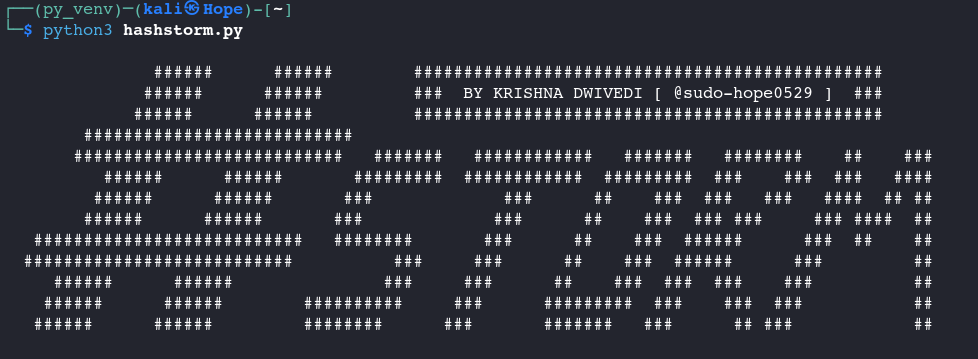

# HashStorm: Python Tool for Hash Identification and Cracking



HashStorm is a Python-based script designed to identify and crack multiple hash types efficiently. Developed by Krishna Dwivedi, this tool provides a command-line interface for tasks like hash type identification, cracking using wordlists, and more. It is intended for educational purposes, ethical hacking, or penetration testing, and supports various hash formats such as MD5 and SHA-256

---
## Features
- Utilizes the hashid Python library to identify over 220 hash types accurately, including MD5, SHA-1, SHA-256, and others, using regular expressions for pattern matching 
- Automatically identifies hash types for one or more hash values.
- Cracks hashes using wordlists or brute-force methods (with planned updates for advanced features).
- Supports batch processing of multiple hashes from files or command-line arguments.
- Includes output saving to history, lookup file for faster cracking, and specified file, and options for future enhancements like Google searches.
- Cross-platform compatibility, as it is written in Python.

---
## Installation
To install and run HashStorm, follow these steps:

- Ensure you have Python latest version installed, as the script relies on Python's standard libraries. Download Python from the official website if needed.

- Clone the repository
```
git clone https://github.com/sudo-hope0529/HashStorm
```

- Move to the HashStorm directory
```
cd HashStorm
```

- Install python modules(libraries) 
```
pip3 install -r lib_requirements.txt
```
[ In kali-linux direct pip3 installation is not permitted without virtual environment upto my current info, so if an error arises use venv ]

- You are good to go, to use 'HashStorm'

---
## Usages

Run python hashstorm.py --help to display this usage information directly. The default icrack mode simplifies workflows by handling both identification and cracking automatically

```
USAGES:
      python hashstorm.py [Options] [Arguments]
      
OPTIONS:
   > --help                    print tool usages
   > identify                  identify the hash-type of specified hash-value
   > crack                     crack the hash-value (!NOTE: hash-type must be passed)
   > icrack [Default]          automatically identify hash-type and crack the hash-value specified
      
ARGUMENTS:
   > -h <hash-value(s)>        Add one or more hash-value to crack or identify followed by ','
   > -hf <hashes file>         Pass a hash file
   > -H <hash-type(s)>         Pass hash-type to crack
   > -w <wordlist-path>        Specify wordlist to use for cracking hash
   > -o <output-file>          Save result in specified file
   > -v                        Verbose mode ( show detailed info while cracking ) [in update]
   > -g                        Perform a google search if hash not cracked [in update]
   > -brute                    Crack hashes using self defined charset and length [in update]
   > -charset <charset>        Specify character set for bruteforccing like "a-z0-9" [in update]
   > -length <pass-max-length> Specify hash word's maximum value [in update]

EXAMPLES:
   > python hashstorm.py identify -h 5d41402abc4b2a76b9719d911017c592
   > python hashstorm.py identify -hf hash-file.txt
   > python hashstorm.py identify -h ae3274d5bfa170ca69bb534be5a22467,5d41402abc4b2a76b9719d911017c592
   > python hashstorm.py crack -H MD5 -h 5d41402abc4b2a76b9719d911017c592 -w wordlist.txt -o output.txt
   > python hashstorm.py crack -H MD5,MD5 -h 5d41402abc4b2a76b9719d911017c592,5d41402abc4b2a76b9719d911017c592 -w wordlist.txt
   > python hashstorm.py -h 5d41402abc4b2a76b9719d911017c592 -w wordlist.txt -o output.txt
   
NOTE: 
   > Tool usages format must be followed
   > Atleast 'hash-value' OR 'hashes-file' must be passed as argument
```

---
## Contributing
Contributions to HashStorm are encouraged to improve features, fix bugs, or add support for more hash types. To contribute:

- Fork the repository on GitHub.
- Create a new branch for your changes.
- Submit a pull request with a detailed description of the changes.
- Before contributing, test your modifications thoroughly 

---
# License
This project is licensed under MIT. See [LICENSE](LICENSE) file for more info.


---
# Acknowledgments
- Inspired by hashid tool in kali for hash identification

- Thanks to resources like HashID module in python for hash identification techniques.
